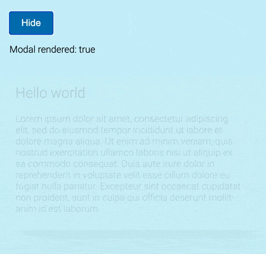

# useDeferredState

A React hook for deferring state change. That's essential when your UI needs to wait for disappearing animation is complete to unmount component.

## Motivation

The problem of waiting a disappearing animation in React is common and usually being skipped as non-trivial. The goal of the project is to make an easy solution of the problem possible in declarative React way.

## Installation

```bash
yarn add use-deferred-state
```

or, using npm

```bash
npm install use-deferred-state
```

## Usage

```tsx
useDeferredState<BaseState>(baseState: BaseState, instantValues: BaseState[] = [], defferFor = 500): BaseState
```

The hook takes a `baseState` and returns it as is but all `baseState` changes are deferred for `defferFor` ms.

You can also pass an `instantValues` – array of possible base state values. When the provided base is equal (by `===` operator) to one of instant values, the returned value is changed immediately.
In example with modal window, displayed in section below, you need to pass `true` as one of instant values, that's creates the following state flows: [show modal -> mount modal], [hide modal -> wait for 500ms -> unmount modal]

### Minimal Example

```tsx
import useDeferredState from 'use-deferred-state';

export const MyReactComponennts = () => {
  const [showModal, setShowModal] = React.useState(false);
  const renderModal = useDeferredState(showModal, [true], 500);

  ...
};
```

### Full example

```tsx
import React from 'react';
import { useDeferredState } from 'use-deferred-state';

export const ExampleApp = () => {
  const [showModal, setShowModal] = React.useState(false);
  const renderModal = useDeferredState(showModal, [true], 500);

  return (
    <div>
      <button className="toggleButton" onClick={() => setShowModal((prevState) => !prevState)}>
        {showModal ? 'hide' : 'show'}
      </button>

      <p>Modal rendered: {String(renderModal)}</p>

      {renderModal && (
        <div className={showModal ? 'modal visible' : 'modal'}>
          <h2>Hello world</h2>
          <p>
            Lorem ipsum dolor sit amet, consectetur adipiscing elit, sed do eiusmod tempor incididunt ut labore et
            dolore magna aliqua. Ut enim ad minim veniam, quis nostrud exercitation ullamco laboris nisi ut aliquip ex
            ea commodo consequat. Duis aute irure dolor in reprehenderit in voluptate velit esse cillum dolore eu fugiat
            nulla pariatur. Excepteur sint occaecat cupidatat non proident, sunt in culpa qui officia deserunt mollit
            anim id est laborum.
          </p>
        </div>
      )}
    </div>
  );
};
```



## Licence

MIT
